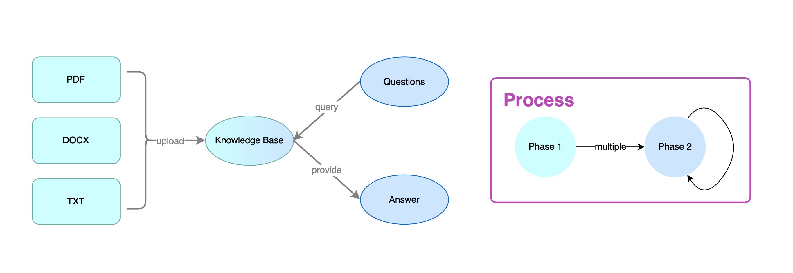

## Running the app
1. Clone the repo or download the ZIP
```
git clone [github https url]
```

2. Install packages
```
npm install
```
After installation, you should now see a `node_modules` folder.

3. Run the website
```
npm run dev
```
Open [http://localhost:3000](http://localhost:3000) with your browser to see the result.

## Future Deployment

1. [Vercel Platform](https://vercel.com/new?utm_medium=default-template&filter=next.js&utm_source=create-next-app&utm_campaign=create-next-app-readme) 
   - Check out [Next.js deployment documentation](https://nextjs.org/docs/deployment) for more details.

2.  [Docker](https://hub.docker.com/) + [Kubernetes](https://kubernetes.io/)
    - [build docker image ](https://docs.docker.com/engine/reference/builder/)
    - [deploy to Kubernetes](https://docs.docker.com/get-started/kube-deploy/)

## Workflow

